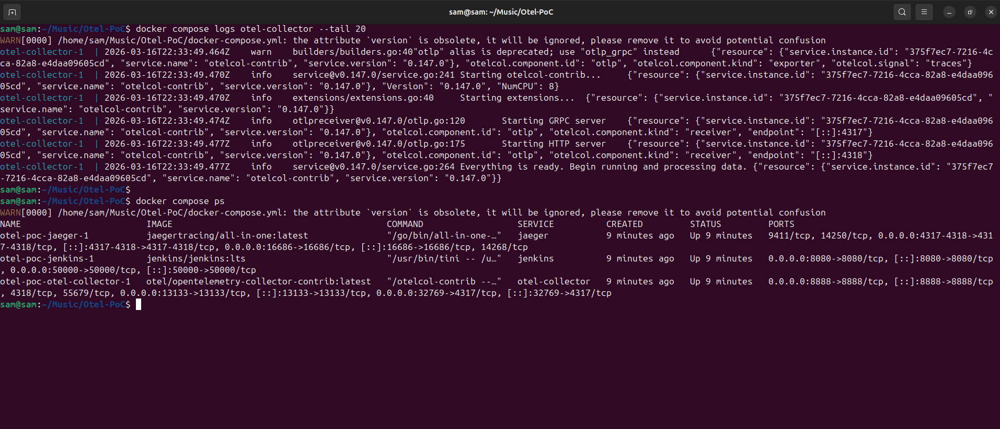
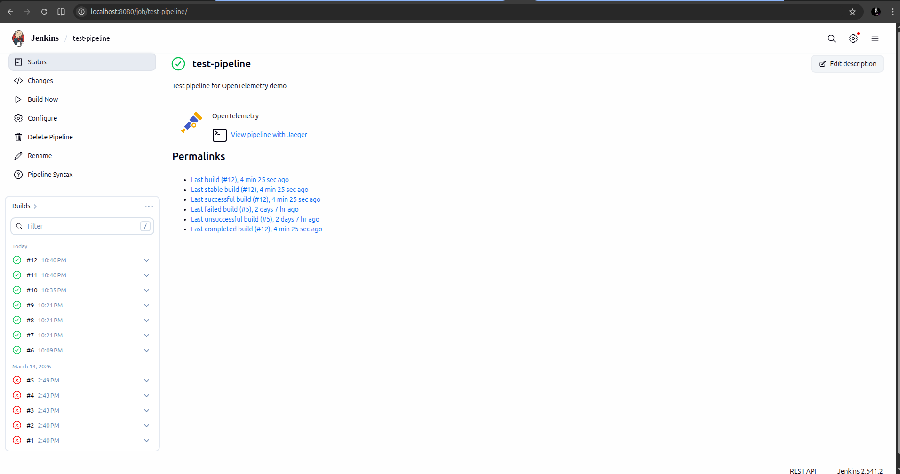
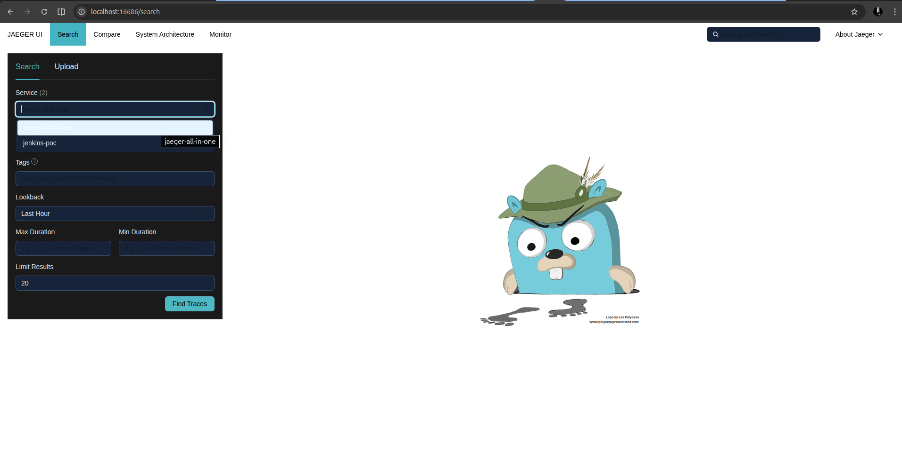
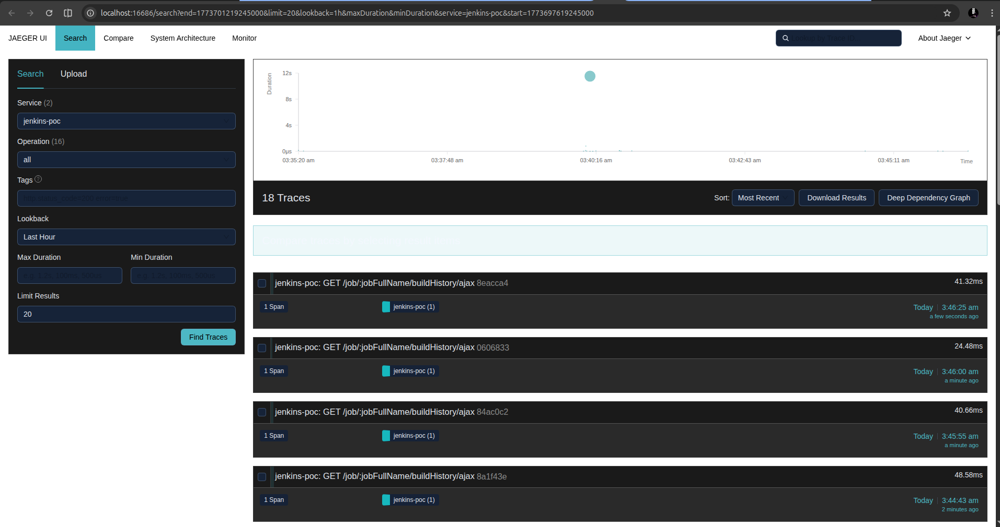
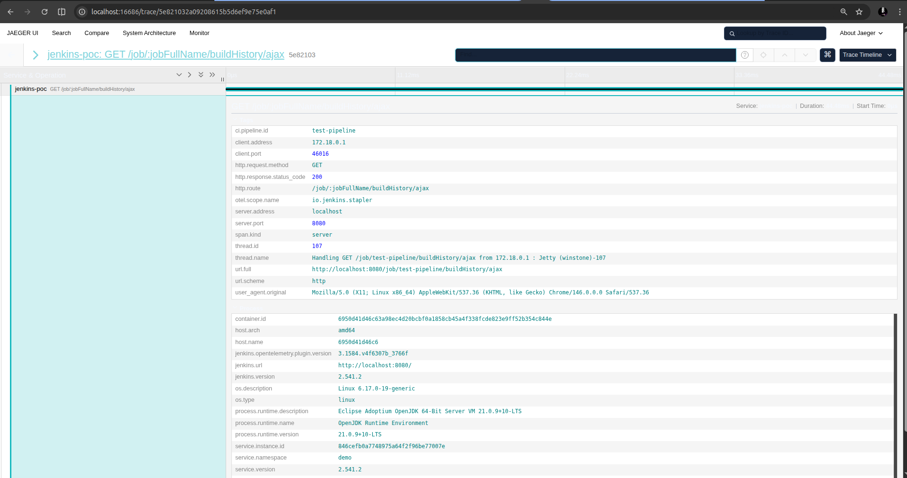
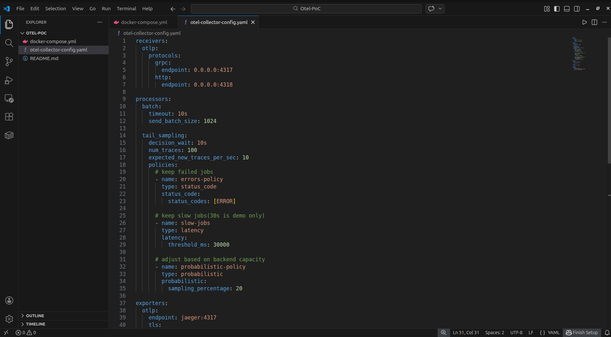

# Jenkins OpenTelemetry PoC (Proof of Concept)

Working demonstration of full-stack observability for Jenkins using OpenTelemetry.

## Architecture:
```
Jenkins (OTel Plugin) => OpenTelemetry Collector => Jaeger
```

## Components:

- **Jenkins**: CI/CD server with OpenTelemetry plugin v3.x
- **OpenTelemetry Collector**: Processes telemetry with tail-based sampling
- **Jaeger**: Distributed tracing backend

## Quick Start:
```bash
docker compose up -d
```

**Access:**
- Jenkins UI: http://localhost:8080
- Jaeger UI: http://localhost:16686

## Intelligent Sampling Strategy:

The collector implements intelligent production-ready sampling:

**100% Retention:**
- Failed jobs (ERROR status) => critical for debugging
- Slow jobs (>30 seconds) => performance anomalies

**20% Sampling:**
- Fast successful jobs => representative sample

This reduces data volume by ~80% while preserving all debugging-critical traces.

## Configuration Highlights:

### Tail-Based Sampling
```yaml
processors:
  tail_sampling:
    policies:
      - name: errors-policy
        type: status_code
        status_code: {status_codes: [ERROR]}
      
      - name: slow-jobs
        type: latency
        latency: {threshold_ms: 30000}
      
      - name: probabilistic-policy
        type: probabilistic
        probabilistic: {sampling_percentage: 20}
```

## Results:

Successfully demonstrates:
- ✅ End-to-end trace propagation from Jenkins to Jaeger
- ✅ Intelligent sampling reducing noise while preserving signals
- ✅ Pipeline stage-level visibility
- ✅ Scalable architecture ready for production deployment

## Screenshots:

### 1. Infrastructure Running
All three components successfully deployed and running in Docker.



### 2. Jenkins Pipeline Executions
Test pipeline running successfully with OpenTelemetry instrumentation enabled.



### 3. Jaeger Service Discovery
Jenkins service (`jenkins-poc`) discovered in Jaeger, confirming trace propagation.



### 4. Trace List
Multiple traces captured from pipeline executions, demonstrating continuous telemetry flow.



### 5. Trace Detail View
Detailed span information showing stage-level visibility and rich metadata (pipeline ID, HTTP details, Jenkins version, container info).



### 6. OpenTelemetry Collector Configuration
Tail-based sampling configuration implementing intelligent data reduction while preserving debugging-critical traces.



## Built For: 

**Project:** Use OpenTelemetry for Jenkins Jobs on ci.jenkins.io

Google Summer of Code 2026  Jenkins Project

**Contributor:** Muhammad Salman [(@SalmanDeveloperz)](https://github.com/SalmanDeveloperz)